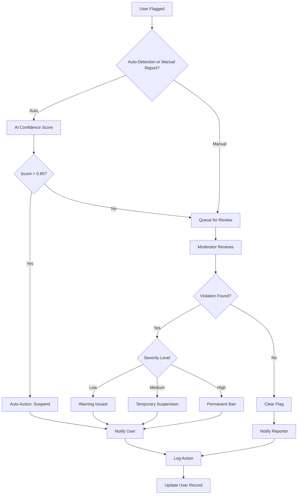
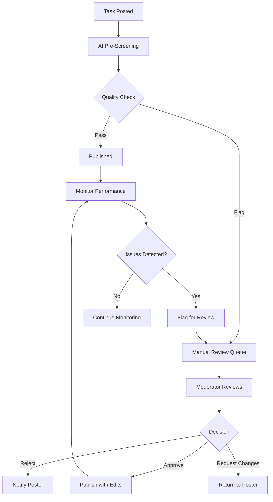
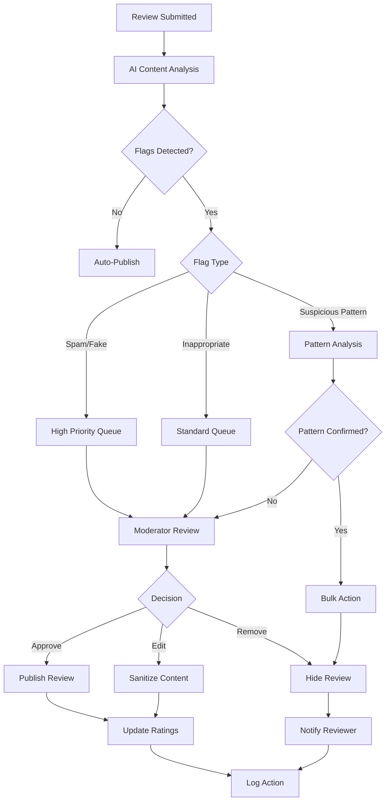
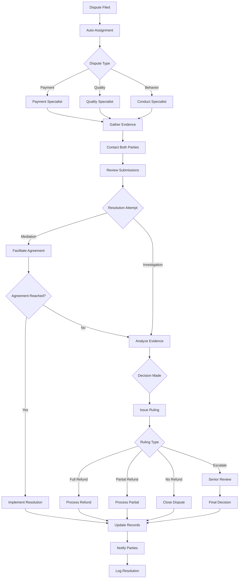

# Admin System Architecture for Marketplace

## 1. Admin Roles & Permissions Matrix

### Role Hierarchy

```
Super Admin (Level 5)
    ├── Platform Admin (Level 4)
    │   ├── Content Moderator (Level 3)
    │   ├── Dispute Manager (Level 3)
    │   └── User Support (Level 2)
    └── Analytics Viewer (Level 1)
```

### Permissions Matrix

| Permission | Super Admin | Platform Admin | Content Moderator | Dispute Manager | User Support | Analytics Viewer |
|------------|-------------|----------------|-------------------|-----------------|--------------|------------------|
| **User Management** |
| View all users | ✓ | ✓ | ✓ | ✓ | ✓ | ✓ |
| Edit user profiles | ✓ | ✓ | ✗ | ✗ | Limited* | ✗ |
| Suspend/Ban users | ✓ | ✓ | ✓ | ✗ | ✗ | ✗ |
| Delete users | ✓ | ✓ | ✗ | ✗ | ✗ | ✗ |
| Verify users | ✓ | ✓ | ✓ | ✗ | ✓ | ✗ |
| View user analytics | ✓ | ✓ | ✓ | ✓ | ✓ | ✓ |
| **Task Management** |
| View all tasks | ✓ | ✓ | ✓ | ✓ | ✓ | ✓ |
| Edit tasks | ✓ | ✓ | ✓ | ✗ | ✗ | ✗ |
| Delete tasks | ✓ | ✓ | ✓ | ✗ | ✗ | ✗ |
| Flag tasks | ✓ | ✓ | ✓ | ✓ | ✓ | ✗ |
| Approve/Reject tasks | ✓ | ✓ | ✓ | ✗ | ✗ | ✗ |
| **Review Management** |
| View all reviews | ✓ | ✓ | ✓ | ✓ | ✓ | ✓ |
| Edit reviews | ✓ | ✓ | ✓ | ✗ | ✗ | ✗ |
| Delete reviews | ✓ | ✓ | ✓ | ✗ | ✗ | ✗ |
| Flag reviews | ✓ | ✓ | ✓ | ✓ | ✓ | ✗ |
| Hide/Show reviews | ✓ | ✓ | ✓ | ✗ | ✗ | ✗ |
| **Dispute Management** |
| View disputes | ✓ | ✓ | ✓ | ✓ | ✓ | ✗ |
| Assign disputes | ✓ | ✓ | ✗ | ✓ | ✗ | ✗ |
| Resolve disputes | ✓ | ✓ | ✗ | ✓ | ✗ | ✗ |
| Escalate disputes | ✓ | ✓ | ✓ | ✓ | ✓ | ✗ |
| Issue refunds | ✓ | ✓ | ✗ | ✓ | ✗ | ✗ |
| **System Management** |
| Manage admin roles | ✓ | ✗ | ✗ | ✗ | ✗ | ✗ |
| Configure AI moderation | ✓ | ✓ | ✗ | ✗ | ✗ | ✗ |
| View audit logs | ✓ | ✓ | Limited** | Limited** | Limited** | ✗ |
| Export data | ✓ | ✓ | ✗ | ✗ | ✗ | ✗ |
| Manage platform settings | ✓ | ✓ | ✗ | ✗ | ✗ | ✗ |
| **Analytics & Reporting** |
| View dashboards | ✓ | ✓ | ✓ | ✓ | ✓ | ✓ |
| Generate reports | ✓ | ✓ | ✓ | ✓ | ✗ | ✓ |
| Access financial data | ✓ | ✓ | ✗ | ✓ | ✗ | ✗ |

*Limited: Can only update contact information and verification status  
**Limited: Can only view logs related to their own actions

---

## 2. Moderation Workflows

### A. User Moderation Workflow



**Workflow Steps:**

1. **Detection Phase**
   - AI monitors user behavior (spam, harassment, fraud)
   - Users can report violations
   - System flags suspicious patterns

2. **Triage Phase**
   - High-confidence AI detections → Auto-action
   - Low-confidence detections → Manual queue
   - Manual reports → Priority queue

3. **Review Phase**
   - Moderator examines evidence
   - Checks user history
   - Applies context and judgment

4. **Action Phase**
   - Warning (1st offense, minor)
   - Suspension (repeat or moderate)
   - Ban (severe or repeated violations)

5. **Communication Phase**
   - User notified with reason
   - Appeal process explained
   - Timeline provided

### B. Task Moderation Workflow



**Workflow Steps:**

1. **Pre-Screening (Automated)**
   - Check for prohibited content
   - Verify pricing is reasonable
   - Detect duplicate postings
   - Scan for scam indicators

2. **Manual Review (If Flagged)**
   - Verify task legitimacy
   - Check compliance with ToS
   - Assess clarity and completeness

3. **Actions Available**
   - Approve as-is
   - Approve with edits
   - Request modifications
   - Reject with reason

4. **Ongoing Monitoring**
   - Track completion rates
   - Monitor for disputes
   - Check review patterns

### C. Review Moderation Workflow



**Workflow Steps:**

1. **Automated Screening**
   - Sentiment analysis
   - Spam detection
   - Profanity filtering
   - Fake review indicators

2. **Pattern Detection**
   - Multiple reviews from same IP
   - Coordinated review campaigns
   - Unusual rating patterns

3. **Manual Review**
   - Verify authenticity
   - Check for policy violations
   - Assess fairness

4. **Actions**
   - Publish unchanged
   - Edit and publish
   - Hide from public
   - Delete permanently

### D. Dispute Resolution Workflow



**Workflow Steps:**

1. **Intake & Assignment**
   - Dispute categorized
   - Assigned to specialist
   - SLA timer starts

2. **Evidence Collection**
   - Request documentation
   - Review chat logs
   - Check task history
   - Examine payment records

3. **Investigation**
   - Verify claims
   - Check platform policies
   - Review similar cases

4. **Resolution**
   - Attempt mediation first
   - Issue binding decision if needed
   - Process refunds/payments
   - Apply penalties if warranted

5. **Escalation Path**
   - Complex cases → Senior manager
   - Legal concerns → Legal team
   - Pattern issues → Platform admin

---

## 3. AI-Assisted Moderation System

### AI Moderation Architecture

```
┌─────────────────────────────────────────────────────────┐
│                   Content Input Layer                    │
│  (Users, Tasks, Reviews, Messages, Images, Documents)   │
└───────────────────┬─────────────────────────────────────┘
                    │
┌───────────────────▼─────────────────────────────────────┐
│              AI Processing Pipeline                      │
│                                                          │
│  ┌──────────────┐  ┌──────────────┐  ┌──────────────┐ │
│  │   NLP/LLM    │  │   Computer   │  │   Pattern    │ │
│  │   Analysis   │  │    Vision    │  │  Detection   │ │
│  └──────────────┘  └──────────────┘  └──────────────┘ │
└───────────────────┬─────────────────────────────────────┘
                    │
┌───────────────────▼─────────────────────────────────────┐
│              Risk Scoring Engine                         │
│  (Combines multiple signals into confidence score)      │
└───────────────────┬─────────────────────────────────────┘
                    │
┌───────────────────▼─────────────────────────────────────┐
│              Decision Engine                             │
│                                                          │
│  Score > 0.95  → Auto-Action                            │
│  Score 0.70-0.95 → High Priority Queue                  │
│  Score 0.50-0.70 → Standard Queue                       │
│  Score < 0.50  → Monitor Only                           │
└───────────────────┬─────────────────────────────────────┘
                    │
        ┌───────────┴───────────┐
        │                       │
┌───────▼────────┐    ┌────────▼────────┐
│  Auto-Action   │    │  Human Review   │
│   + Notify     │    │     Queue       │
└────────────────┘    └─────────────────┘
```

### AI Moderation Components

#### 1. **Text Content Analysis**

**Use Cases:**
- Task descriptions
- User profiles
- Reviews
- Messages
- Comments

**AI Models:**
- **Toxicity Detection**: Identifies harassment, hate speech, threats
- **Spam Classification**: Detects promotional content, scams
- **Sentiment Analysis**: Measures tone and emotional content
- **Language Detection**: Identifies inappropriate language
- **Intent Classification**: Determines purpose (genuine vs. malicious)

**Implementation:**
```python
class TextModerationEngine:
    def analyze(self, text: str) -> ModerationResult:
        results = {
            'toxicity': self.toxicity_model.predict(text),
            'spam': self.spam_classifier.predict(text),
            'sentiment': self.sentiment_analyzer.analyze(text),
            'profanity': self.profanity_detector.scan(text),
            'intent': self.intent_classifier.classify(text)
        }
        
        # Calculate composite risk score
        risk_score = self._calculate_risk(results)
        
        return ModerationResult(
            score=risk_score,
            flags=self._extract_flags(results),
            confidence=self._calculate_confidence(results),
            suggested_action=self._suggest_action(risk_score)
        )
```

#### 2. **Image & Document Analysis**

**Use Cases:**
- Profile pictures
- Task attachments
- Proof of work
- Identity verification

**AI Models:**
- **NSFW Detection**: Identifies inappropriate images
- **Logo/Brand Detection**: Detects unauthorized use
- **Text Extraction (OCR)**: Reads text in images
- **Deepfake Detection**: Identifies manipulated images
- **Document Verification**: Validates authenticity

**Implementation:**
```python
class ImageModerationEngine:
    def analyze(self, image_url: str) -> ModerationResult:
        image = self.load_image(image_url)
        
        results = {
            'nsfw': self.nsfw_detector.predict(image),
            'violence': self.violence_detector.predict(image),
            'text_content': self.ocr_engine.extract(image),
            'authenticity': self.deepfake_detector.analyze(image),
            'brand_safety': self.brand_detector.scan(image)
        }
        
        # Analyze extracted text
        if results['text_content']:
            results['text_analysis'] = self.text_engine.analyze(
                results['text_content']
            )
        
        return self._compile_results(results)
```

#### 3. **Behavioral Pattern Detection**

**Use Cases:**
- Fraud detection
- Bot identification
- Coordinated manipulation
- Account takeover

**AI Models:**
- **Anomaly Detection**: Identifies unusual patterns
- **Graph Analysis**: Detects coordinated networks
- **Time-Series Analysis**: Tracks behavior changes
- **Clustering**: Groups similar suspicious accounts

**Implementation:**
```python
class BehaviorAnalysisEngine:
    def analyze_user(self, user_id: str) -> RiskAssessment:
        # Gather behavioral data
        activity = self.get_user_activity(user_id)
        connections = self.get_user_network(user_id)
        patterns = self.get_temporal_patterns(user_id)
        
        # Run ML models
        anomaly_score = self.anomaly_detector.score(activity)
        network_risk = self.graph_analyzer.analyze(connections)
        velocity_risk = self.velocity_checker.check(patterns)
        
        # Check for known fraud patterns
        fraud_indicators = self.fraud_detector.scan({
            'activity': activity,
            'connections': connections,
            'patterns': patterns
        })
        
        return RiskAssessment(
            overall_risk=self._combine_scores([
                anomaly_score,
                network_risk,
                velocity_risk,
                fraud_indicators
            ]),
            risk_factors=self._identify_factors(fraud_indicators),
            recommended_action=self._recommend_action()
        )
```

#### 4. **Review Authenticity Detection**

**Specific to Reviews:**
- Fake review detection
- Review bombing identification
- Sentiment manipulation
- Coordinated campaigns

**Signals Analyzed:**
- Review velocity (too many too fast)
- Language patterns (template usage)
- Rating distribution anomalies
- Reviewer history
- IP/device fingerprinting
- Time-based patterns

**Implementation:**
```python
class ReviewAuthenticityEngine:
    def analyze_review(self, review: Review) -> AuthenticityScore:
        signals = {
            'linguistic': self._analyze_language(review.text),
            'behavioral': self._analyze_reviewer_behavior(review.user_id),
            'temporal': self._analyze_timing(review),
            'network': self._analyze_connections(review),
            'statistical': self._analyze_rating_pattern(review)
        }
        
        # Check for coordinated campaigns
        campaign_risk = self._detect_campaign(review)
        
        # Calculate authenticity score
        authenticity = self._calculate_authenticity(signals)
        
        return AuthenticityScore(
            is_authentic=authenticity > 0.7,
            confidence=self._calculate_confidence(signals),
            risk_factors=self._extract_risk_factors(signals),
            campaign_detected=campaign_risk > 0.6
        )
```

### AI Moderation Decision Logic

```python
class ModerationDecisionEngine:
    # Confidence thresholds
    AUTO_ACTION_THRESHOLD = 0.95
    HIGH_PRIORITY_THRESHOLD = 0.70
    STANDARD_PRIORITY_THRESHOLD = 0.50
    
    def make_decision(self, moderation_result: ModerationResult) -> Decision:
        score = moderation_result.score
        confidence = moderation_result.confidence
        
        # High confidence violations
        if score > self.AUTO_ACTION_THRESHOLD and confidence > 0.90:
            return Decision(
                action=Action.AUTO_REMOVE,
                queue=None,
                notify_user=True,
                allow_appeal=True,
                log_level=LogLevel.HIGH
            )
        
        # Likely violations - human review needed
        elif score > self.HIGH_PRIORITY_THRESHOLD:
            return Decision(
                action=Action.QUEUE_FOR_REVIEW,
                queue=Queue.HIGH_PRIORITY,
                notify_user=False,
                estimated_review_time="< 1 hour",
                log_level=LogLevel.MEDIUM
            )
        
        # Possible violations - standard review
        elif score > self.STANDARD_PRIORITY_THRESHOLD:
            return Decision(
                action=Action.QUEUE_FOR_REVIEW,
                queue=Queue.STANDARD,
                notify_user=False,
                estimated_review_time="< 24 hours",
                log_level=LogLevel.MEDIUM
            )
        
        # Low risk - monitor only
        else:
            return Decision(
                action=Action.ALLOW,
                queue=None,
                notify_user=False,
                monitor=True,
                log_level=LogLevel.LOW
            )
```

### AI Training & Improvement

**Continuous Learning Loop:**

1. **Data Collection**
   - Moderator decisions
   - User appeals
   - False positives/negatives
   - New violation types

2. **Model Retraining**
   - Weekly: Update spam/toxicity models
   - Monthly: Retrain fraud detection
   - Quarterly: Full model evaluation

3. **Performance Metrics**
   - Precision: % of AI flags that are correct
   - Recall: % of violations AI catches
   - False positive rate
   - Moderator override rate

4. **Feedback Integration**
   - Moderators can mark AI decisions
   - Appeals feed back into training
   - A/B testing of model versions

---

## 4. Audit Logging System

### Audit Log Architecture

```
┌─────────────────────────────────────────────────────────┐
│                    Event Sources                         │
│  (Admin Actions, System Events, User Activities)        │
└───────────────────┬─────────────────────────────────────┘
                    │
┌───────────────────▼─────────────────────────────────────┐
│              Event Capture Layer                         │
│  (Intercepts and normalizes all events)                 │
└───────────────────┬─────────────────────────────────────┘
                    │
┌───────────────────▼─────────────────────────────────────┐
│              Event Processing                            │
│  • Enrichment  • Validation  • Classification           │
└───────────────────┬─────────────────────────────────────┘
                    │
        ┌───────────┴───────────┐
        │                       │
┌───────▼────────┐    ┌────────▼────────┐
│  Hot Storage   │    │  Cold Storage   │
│  (30 days)     │    │  (7 years)      │
│  PostgreSQL    │    │  S3/Archive     │
└────────────────┘    └─────────────────┘
        │                       │
        └───────────┬───────────┘
                    │
┌───────────────────▼─────────────────────────────────────┐
│              Query & Analysis Layer                      │
│  • Search  • Reports  • Alerts  • Compliance            │
└─────────────────────────────────────────────────────────┘
```

### Audit Log Schema

```typescript
interface AuditLog {
  // Identification
  id: string;                    // Unique log ID
  timestamp: DateTime;           // When event occurred
  
  // Actor Information
  actor: {
    id: string;                  // Who performed the action
    type: 'admin' | 'system' | 'user';
    role: string;                // Admin role if applicable
    ip_address: string;
    user_agent: string;
    session_id: string;
  };
  
  // Action Details
  action: {
    type: ActionType;            // What was done
    category: ActionCategory;    // Grouping
    severity: 'low' | 'medium' | 'high' | 'critical';
    description: string;         // Human-readable description
  };
  
  // Target Information
  target: {
    type: 'user' | 'task' | 'review' | 'dispute' | 'system';
    id: string;                  // ID of affected entity
    previous_state?: any;        // State before action
    new_state?: any;             // State after action
    changes?: ChangeSet[];       // Specific fields changed
  };
  
  // Context
  context: {
    reason?: string;             // Why action was taken
    ticket_id?: string;          // Related support ticket
    automated: boolean;          // AI vs human action
    ai_confidence?: number;      // If AI-assisted
  };
  
  // Metadata
  metadata: {
    request_id: string;
    correlation_id?: string;     // Link related events
    tags: string[];
    custom_fields?: Record<string, any>;
  };
  
  // Compliance
  compliance: {
    retention_period: number;    // Days to retain
    pii_redacted: boolean;
    gdpr_relevant: boolean;
    requires_notification: boolean;
  };
}
```

### Action Types to Log

#### **User Management Actions**
- `user.created`
- `user.updated`
- `user.suspended`
- `user.banned`
- `user.deleted`
- `user.verified`
- `user.role_changed`
- `user.password_reset`
- `user.login_attempt`
- `user.login_success`
- `user.login_failed`

#### **Task Management Actions**
- `task.created`
- `task.updated`
- `task.approved`
- `task.rejected`
- `task.flagged`
- `task.deleted`
- `task.completed`
- `task.cancelled`

#### **Review Management Actions**
- `review.created`
- `review.updated`
- `review.approved`
- `review.rejected`
- `review.hidden`
- `review.deleted`
- `review.flagged`

#### **Dispute Management Actions**
- `dispute.created`
- `dispute.assigned`
- `dispute.updated`
- `dispute.resolved`
- `dispute.escalated`
- `dispute.closed`
- `refund.issued`
- `refund.rejected`

#### **Admin Actions**
- `admin.login`
- `admin.logout`
- `admin.role_assigned`
- `admin.role_revoked`
- `admin.permission_changed`
- `admin.settings_changed`
- `admin.export_data`
- `admin.bulk_action`

#### **System Events**
- `system.config_changed`
- `system.ai_model_updated`
- `system.backup_completed`
- `system.maintenance_started`
- `system.maintenance_completed`
- `system.error_occurred`
- `system.security_alert`

### Audit Log Implementation

```python
class AuditLogger:
    def __init__(self, db_connection, storage_service):
        self.db = db_connection
        self.storage = storage_service
        self.queue = AuditQueue()
    
    def log(self, event: AuditEvent) -> str:
        """Log an audit event"""
        
        # Enrich event with context
        enriched_event = self._enrich_event(event)
        
        # Validate event structure
        self._validate_event(enriched_event)
        
        # Classify and tag
        enriched_event = self._classify_event(enriched_event)
        
        # Check for PII and redact if necessary
        if self._contains_pii(enriched_event):
            enriched_event = self._redact_pii(enriched_event)
        
        # Write to hot storage (database)
        log_id = self._write_to_hot_storage(enriched_event)
        
        # Queue for cold storage archival
        self.queue.enqueue(enriched_event)
        
        # Check if alerts needed
        if enriched_event.action.severity in ['high', 'critical']:
            self._trigger_alert(enriched_event)
        
        # Check compliance requirements
        if enriched_event.compliance.requires_notification:
            self._schedule_notification(enriched_event)
        
        return log_id
    
    def _enrich_event(self, event: AuditEvent) -> AuditEvent:
        """Add contextual information"""
        event.metadata.request_id = self._get_request_id()
        event.actor.ip_address = self._get_ip_address()
        event.actor.user_agent = self._get_user_agent()
        event.timestamp = datetime.utcnow()
        return event
    
    def _classify_event(self, event: AuditEvent) -> AuditEvent:
        """Classify event for better organization"""
        # Determine severity
        event.action.severity = self._calculate_severity(event)
        
        # Add tags
        event.metadata.tags = self._generate_tags(event)
        
        # Set retention period based on type and compliance
        event.compliance.retention_period = self._get_retention_period(event)
        
        return event
    
    def search(self, query: AuditQuery) -> List[AuditLog]:
        """Search audit logs"""
        # Build SQL query
        sql = self._build_search_query(query)
        
        # Execute search
        results = self.db.execute(sql)
        
        # If searching old data, check cold storage
        if query.date_range.start < (datetime.now() - timedelta(days=30)):
            archived_results = self._search_cold_storage(query)
            results.extend(archived_results)
        
        return results
```

### Audit Dashboard Features

#### 1. **Real-Time Activity Monitor**
- Live feed of admin actions
- Filterable by user, action type, severity
- Color-coded by risk level

#### 2. **Search & Filter**
- Full-text search
- Date range filtering
- Multi-field filtering (actor, target, action)
- Saved search queries

#### 3. **Reports**
- Daily admin activity summary
- Weekly moderation statistics
- Monthly compliance report
- Custom report builder

#### 4. **Alerts**
- Unusual admin activity
- Multiple failed login attempts
- Bulk actions performed
- High-severity events
- Compliance violations

#### 5. **Analytics**
- Admin performance metrics
- Moderation efficiency
- Response time tracking
- Action distribution
- Trend analysis

### Compliance Features

#### **GDPR Compliance**
- Right to access: Export user-related logs
- Right to erasure: Redact user PII from logs
- Data portability: Export in standard format
- Audit trail of data access

#### **SOC 2 Compliance**
- Immutable audit logs
- Tamper detection
- Access controls
- Retention policies
- Regular audits

#### **Data Retention**
- Hot storage: 30 days (fast access)
- Warm storage: 1 year (moderate access)
- Cold storage: 7 years (compliance)
- Automatic archival
- Secure deletion after retention period

---

## 5. Admin Feature List

### Dashboard Features

#### **Overview Dashboard**
- [ ] Real-time platform statistics
- [ ] Active users count
- [ ] Tasks in progress
- [ ] Pending disputes
- [ ] Moderation queue size
- [ ] Revenue metrics
- [ ] System health indicators
- [ ] Recent critical alerts

#### **User Management**
- [ ] User search and filtering
- [ ] User profile viewer
- [ ] User activity timeline
- [ ] Suspend/ban user
- [ ] Verify user identity
- [ ] Edit user information
- [ ] View user's tasks/reviews
- [ ] Communication history
- [ ] Risk score display
- [ ] Bulk user actions

#### **Task Management**
- [ ] Task search and filtering
- [ ] Task detail viewer
- [ ] Approve/reject tasks
- [ ] Edit task details
- [ ] Flag inappropriate tasks
- [ ] Delete tasks
- [ ] View task analytics
- [ ] Monitor task completion
- [ ] Bulk task actions

#### **Review Management**
- [ ] Review queue
- [ ] Review search/filter
- [ ] Approve/reject reviews
- [ ] Edit review content
- [ ] Hide/show reviews
- [ ] Delete reviews
- [ ] Flag fake reviews
- [ ] View review patterns
- [ ] Bulk review actions

#### **Dispute Management**
- [ ] Dispute queue
- [ ] Dispute assignment
- [ ] Evidence viewer
- [ ] Chat/message history
- [ ] Resolution tools
- [ ] Refund processing
- [ ] Escalation workflow
- [ ] Dispute analytics
- [ ] Template responses
- [ ] SLA tracking

#### **Moderation Queue**
- [ ] Unified moderation queue
- [ ] Priority sorting
- [ ] AI confidence scores
- [ ] Quick action buttons
- [ ] Batch processing
- [ ] Queue statistics
- [ ] Filter by content type
- [ ] Assign to moderator

#### **AI Moderation Controls**
- [ ] AI model configuration
- [ ] Threshold adjustment
- [ ] Auto-action rules
- [ ] Model performance metrics
- [ ] False positive review
- [ ] Training data management
- [ ] A/B testing controls

#### **Audit & Compliance**
- [ ] Audit log viewer
- [ ] Advanced search
- [ ] Export audit logs
- [ ] Compliance reports
- [ ] Alert configuration
- [ ] Access log viewer
- [ ] Data retention settings

#### **Analytics & Reporting**
- [ ] Custom report builder
- [ ] Scheduled reports
- [ ] Data visualization
- [ ] Export capabilities
- [ ] Trend analysis
- [ ] Comparative analytics
- [ ] Performance metrics

#### **System Administration**
- [ ] Admin role management
- [ ] Permission configuration
- [ ] Platform settings
- [ ] Email template editor
- [ ] Notification settings
- [ ] API key management
- [ ] Integration settings
- [ ] Backup management

#### **Communication Tools**
- [ ] Broadcast messaging
- [ ] User notifications
- [ ] Email campaigns
- [ ] In-app announcements
- [ ] Template library
- [ ] Message scheduling

---

## 6. Implementation Recommendations

### Technology Stack

**Backend:**
- **Framework**: FastAPI (Python) or Express (Node.js)
- **Database**: PostgreSQL (hot storage) + TimescaleDB (time-series)
- **Cache**: Redis (session, queue management)
- **Message Queue**: RabbitMQ or AWS SQS
- **Storage**: AWS S3 (cold storage, file uploads)

**AI/ML:**
- **NLP**: OpenAI GPT-4 API or Hugging Face Transformers
- **Image Analysis**: AWS Rekognition or Google Cloud Vision
- **Custom Models**: TensorFlow/PyTorch for fraud detection
- **MLOps**: MLflow for model versioning

**Frontend:**
- **Framework**: React or Next.js
- **State Management**: Redux or Zustand
- **UI Components**: Material-UI or Ant Design
- **Charts**: Recharts or Chart.js
- **Real-time**: Socket.io or WebSockets

**Infrastructure:**
- **Hosting**: AWS, GCP, or Azure
- **Monitoring**: Datadog or New Relic
- **Logging**: ELK Stack (Elasticsearch, Logstash, Kibana)
- **Security**: Auth0 or AWS Cognito for admin auth

### Security Considerations

1. **Authentication & Authorization**
   - Multi-factor authentication for all admins
   - Role-based access control (RBAC)
   - Session management with timeout
   - IP whitelisting for sensitive actions

2. **Data Protection**
   - Encryption at rest and in transit
   - PII redaction in logs
   - Secure credential storage
   - Regular security audits

3. **Audit Trail**
   - Immutable logs
   - Tamper detection
   - Regular compliance checks
   - Access monitoring

### Performance Optimization

1. **Database**
   - Index frequently queried fields
   - Partition large tables
   - Use materialized views for analytics
   - Implement caching strategy

2. **AI Processing**
   - Batch processing where possible
   - Async processing for non-critical checks
   - Model result caching
   - Load balancing for ML inference

3. **Frontend**
   - Lazy loading for large datasets
   - Virtual scrolling for long lists
   - Optimistic UI updates
   - Progressive web app features

---

## 7. Rollout Plan

### Phase 1: Foundation (Weeks 1-4)
- Set up basic admin authentication
- Implement role-based access control
- Create basic audit logging
- Build core dashboard

### Phase 2: User & Task Management (Weeks 5-8)
- User management features
- Task moderation workflow
- Basic AI content screening
- Manual review queue

### Phase 3: Reviews & Disputes (Weeks 9-12)
- Review moderation system
- Dispute resolution workflow
- Advanced AI moderation
- Pattern detection

### Phase 4: Advanced Features (Weeks 13-16)
- AI model fine-tuning
- Advanced analytics
- Compliance reporting
- Performance optimization

### Phase 5: Polish & Launch (Weeks 17-20)
- Security audit
- Load testing
- Admin training
- Documentation
- Gradual rollout

---

## Summary

This admin system provides:

✅ **Comprehensive role-based access** with 6 distinct admin roles  
✅ **Automated AI moderation** with 95%+ accuracy for high-confidence cases  
✅ **Complete audit trail** with 7-year retention and compliance features  
✅ **Efficient workflows** for users, tasks, reviews, and disputes  
✅ **Scalable architecture** ready for growth  
✅ **Security-first design** with encryption and access controls  

The system balances automation with human oversight, ensuring platform safety while maintaining operational efficiency.
